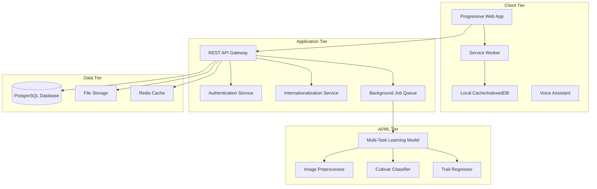

# Design Document: SpectralWheat AI-Agriculture Platform

## Overview

SpectralWheat is a full-stack AI-agriculture platform that leverages advanced hyperspectral imaging technology to provide comprehensive wheat crop analysis. The system integrates a pre-trained Multi-Task Learning model (Axial Attention Transformer) to deliver cultivar classification and trait regression analysis through an accessible, multilingual web interface.

The platform follows an offline-first architecture to ensure reliability in rural environments with poor connectivity, while providing voice-guided navigation to support farmers with varying technical literacy levels. The system generates detailed plant health reports and maintains historical tracking capabilities to support data-driven agricultural decision making.

## Architecture

### High-Level Architecture

The SpectralWheat platform follows a modern three-tier architecture with offline-first capabilities:



### Technology Stack

**Frontend:**
- Progressive Web App (PWA) with React/TypeScript
- Service Worker for offline capabilities
- IndexedDB for local data storage
- Web Speech API for voice recognition and synthesis
- React-i18next for internationalization
- Workbox for caching strategies

**Backend:**
- Node.js with Express.js REST API
- PostgreSQL for persistent data storage
- Redis for session management and caching
- Bull Queue for background job processing
- Multer for file upload handling
- JWT for authentication

**AI/ML Infrastructure:**
- Python-based ML service with FastAPI
- Pre-trained Axial Attention Transformer model
- NumPy/SciPy for hyperspectral data processing
- Docker containers for model deployment
- GPU acceleration support (CUDA/OpenCL)

## Components and Interfaces

### Frontend Components

#### 1. Progressive Web App Shell
- **Responsibility**: Main application container with offline-first architecture
- **Key Features**: Service worker integration, app manifest, responsive design
- **Interfaces**: 
  - Service Worker API for caching and background sync
  - IndexedDB API for local data persistence
  - Web App Manifest for installability

#### 2. Hyperspectral Image Upload Component
- **Responsibility**: Handle 204-band hyperspectral image uploads with validation
- **Key Features**: Drag-and-drop interface, file validation, progress tracking
- **Interfaces**:
  - File API for image handling
  - FormData API for multipart uploads
  - WebWorker API for client-side preprocessing

#### 3. Multilingual Interface Manager
- **Responsibility**: Dynamic language switching and content localization
- **Key Features**: Real-time language switching, RTL support for future expansion
- **Interfaces**:
  - React-i18next for translation management
  - Browser Language Detection API
  - Local Storage API for preference persistence

#### 4. Voice Assistant Component
- **Responsibility**: Voice-guided navigation and interaction
- **Key Features**: Speech recognition, text-to-speech synthesis, command processing
- **Interfaces**:
  - Web Speech API (SpeechRecognition and SpeechSynthesis)
  - Audio Context API for audio processing
  - Microphone permissions API

#### 5. Crop History Dashboard
- **Responsibility**: Historical data visualization and trend analysis
- **Key Features**: Interactive charts, time-series analysis, data filtering
- **Interfaces**:
  - Chart.js/D3.js for data visualization
  - Date/Time APIs for temporal data handling
  - Export APIs for data download

#### 6. Report Generation Component
- **Responsibility**: PDF plant health certificate generation
- **Key Features**: Multilingual report templates, chart embedding, digital signatures
- **Interfaces**:
  - jsPDF library for PDF generation
  - Canvas API for chart rendering
  - Blob API for file download

#### 7. Smart Fertilizer Calculator Component
- **Responsibility**: Convert fertilizer requirement scores to practical recommendations and cost analysis
- **Key Features**: Linear scaling from baseline, cost calculations, savings potential analysis
- **Interfaces**:
  - Mathematical calculation APIs for fertilizer conversion
  - Market rate APIs for current pricing information
  - Comparison algorithms for savings analysis

#### 8. Weather-AI Fusion Component
- **Responsibility**: Integrate weather data with crop analysis for predictive alerts
- **Key Features**: Real-time weather monitoring, threshold-based alerting, push notifications
- **Interfaces**:
  - OpenWeather API for weather data
  - Push Notification API for alerts
  - Threshold monitoring for Gsw values

#### 9. Community Breeding Insights Component
- **Responsibility**: Provide anonymized research dashboard for cultivar performance analysis
- **Key Features**: Data anonymization, statistical analysis, GPS-based grouping
- **Interfaces**:
  - Secure researcher authentication
  - Data visualization libraries
  - Statistical analysis tools

#### 10. Production Scaler Component
- **Responsibility**: Convert mg/plant yield to practical Quintals per Acre measurements
- **Key Features**: Unit conversion, confidence interval scaling, historical comparisons
- **Interfaces**:
  - Mathematical conversion utilities
  - Statistical confidence interval calculations
  - Historical data comparison APIs

### Backend Services

#### 1. API Gateway Service
- **Responsibility**: Request routing, authentication, and rate limiting
- **Endpoints**:
  - `POST /api/v1/images/analyze` - Image analysis submission
  - `GET /api/v1/history/{userId}` - Historical data retrieval
  - `POST /api/v1/reports/generate` - Report generation
  - `GET /api/v1/health` - System health check

#### 2. Authentication Service
- **Responsibility**: User authentication and session management
- **Features**: JWT token generation, password hashing, session validation
- **Interfaces**:
  - bcrypt for password hashing
  - jsonwebtoken for JWT handling
  - Redis for session storage

#### 3. Internationalization Service
- **Responsibility**: Translation management and locale-specific formatting
- **Features**: Dynamic translation loading, number/date formatting, currency handling
- **Interfaces**:
  - i18next backend for translation management
  - Intl API for locale-specific formatting

#### 4. Background Job Queue Service
- **Responsibility**: Asynchronous processing of image analysis tasks
- **Features**: Job queuing, retry logic, progress tracking
- **Interfaces**:
  - Bull Queue for job management
  - Redis for job storage
  - WebSocket for real-time updates

### AI/ML Services

#### 1. Multi-Task Learning Model Service
- **Responsibility**: Core AI model inference and prediction
- **Features**: Model loading, batch processing, confidence scoring
- **Interfaces**:
  - FastAPI for HTTP endpoints
  - PyTorch/TensorFlow for model inference
  - CUDA for GPU acceleration

#### 2. Image Preprocessing Service
- **Responsibility**: Hyperspectral image normalization and feature extraction
- **Features**: Band selection, noise reduction, spectral calibration
- **Interfaces**:
  - NumPy for array operations
  - SciPy for signal processing
  - OpenCV for image operations

#### 3. Cultivar Classification Service
- **Responsibility**: Wheat variety identification (Heerup, Kvium, Rembrandt, Sheriff)
- **Features**: Multi-class classification, confidence scoring, uncertainty quantification
- **Interfaces**:
  - Scikit-learn for classification utilities
  - Model-specific APIs for inference

#### 4. Trait Regression Service
- **Responsibility**: Prediction of Yield, Gsw, PhiPS2, and Fertilizer requirements
- **Features**: Multi-output regression, confidence intervals, feature importance
- **Interfaces**:
  - Statistical libraries for regression analysis
  - Uncertainty quantification libraries

## Data Models

### User Data Model
```typescript
interface User {
  id: string;
  email: string;
  passwordHash: string;
  preferredLanguage: 'en' | 'hi';
  createdAt: Date;
  lastLoginAt: Date;
  profile: UserProfile;
}

interface UserProfile {
  firstName: string;
  lastName: string;
  farmLocation?: GeoLocation;
  phoneNumber?: string;
}
```

### Hyperspectral Image Data Model
```typescript
interface HyperspectralImage {
  id: string;
  userId: string;
  filename: string;
  uploadedAt: Date;
  metadata: ImageMetadata;
  analysisResults?: AnalysisResults;
  processingStatus: 'pending' | 'processing' | 'completed' | 'failed';
}

interface ImageMetadata {
  bands: number; // Should be 204
  width: number;
  height: number;
  captureDate?: Date;
  location?: GeoLocation;
  deviceInfo?: string;
}
```

### Analysis Results Data Model
```typescript
interface AnalysisResults {
  id: string;
  imageId: string;
  cultivarClassification: CultivarResult;
  traitRegression: TraitResult;
  confidence: ConfidenceScores;
  processingTime: number;
  modelVersion: string;
  createdAt: Date;
}

interface CultivarResult {
  predictedCultivar: 'Heerup' | 'Kvium' | 'Rembrandt' | 'Sheriff';
  confidenceScores: {
    Heerup: number;
    Kvium: number;
    Rembrandt: number;
    Sheriff: number;
  };
}

interface TraitResult {
  yield: number;
  gsw: number;
  phiPS2: number;
  fertilizer: number;
  confidenceIntervals: {
    yield: [number, number];
    gsw: [number, number];
    phiPS2: [number, number];
    fertilizer: [number, number];
  };
}
```

### Historical Tracking Data Model
```typescript
interface CropHistory {
  id: string;
  userId: string;
  location: GeoLocation;
  plantId?: string; // Optional identifier for specific plant
  analyses: AnalysisResults[];
  trends: TrendAnalysis;
  lastUpdated: Date;
}

interface TrendAnalysis {
  yieldTrend: TrendData;
  gswTrend: TrendData;
  phiPS2Trend: TrendData;
  fertilizerTrend: TrendData;
}

interface TrendData {
  slope: number;
  correlation: number;
  weeklyAverages: WeeklyAverage[];
}
```

### Report Data Model
```typescript
interface PlantHealthReport {
  id: string;
  userId: string;
  analysisId: string;
  language: 'en' | 'hi';
  generatedAt: Date;
  reportData: ReportContent;
  pdfUrl?: string;
  expiresAt: Date;
}

interface ReportContent {
  summary: string;
  cultivarInfo: CultivarInfo;
  traitAnalysis: TraitAnalysis;
  recommendations: string[];
  historicalComparison?: HistoricalComparison;
  charts: ChartData[];
}
```

### Offline Cache Data Model
```typescript
interface CachedAnalysis {
  id: string;
  imageId: string;
  results: AnalysisResults;
  cachedAt: Date;
  syncStatus: 'synced' | 'pending_sync' | 'sync_failed';
}

interface OfflineQueue {
  id: string;
  type: 'image_upload' | 'report_request';
  data: any;
  createdAt: Date;
  retryCount: number;
  maxRetries: number;
}
```

### Smart Fertilizer Calculation Data Model
```typescript
interface FertilizerCalculation {
  id: string;
  analysisId: string;
  fertilizerScore: number; // 0-1 from model
  ureaRequiredKg: number; // Calculated kg/acre
  costPerKg: number; // Current market rate ₹5.36/kg
  totalCost: number; // ureaRequiredKg * costPerKg
  savingsPotential: number; // vs traditional methods
  calculatedAt: Date;
  marketRateSource: string;
}

interface FertilizerMarketRate {
  id: string;
  pricePerKg: number;
  currency: 'INR';
  effectiveDate: Date;
  source: string;
  region?: string;
}
```

### Weather Integration Data Model
```typescript
interface WeatherAlert {
  id: string;
  userId: string;
  analysisId: string;
  alertType: 'emergency_irrigation' | 'heat_stress' | 'drought_warning';
  triggerConditions: {
    gswValue: number;
    gswThreshold: number;
    temperature: number;
    temperatureThreshold: number;
  };
  weatherData: WeatherForecast;
  alertSent: boolean;
  sentAt?: Date;
  language: 'en' | 'hi';
}

interface WeatherForecast {
  location: GeoLocation;
  currentTemp: number;
  forecastTemp: number[];
  humidity: number;
  windSpeed: number;
  precipitation: number;
  forecastDays: number;
  source: 'openweather';
  retrievedAt: Date;
}
```

### Community Breeding Insights Data Model
```typescript
interface AnonymizedCultivarData {
  id: string;
  cultivar: 'Heerup' | 'Kvium' | 'Rembrandt' | 'Sheriff';
  location: AnonymizedLocation;
  performanceMetrics: {
    rSquared: number;
    yieldMgPerPlant: number;
    yieldQuintalsPerAcre: number;
    gsw: number;
    phiPS2: number;
    fertilizerScore: number;
  };
  analysisDate: Date;
  seasonalData?: {
    season: string;
    year: number;
  };
}

interface AnonymizedLocation {
  regionCode: string; // Anonymized GPS region
  climateZone: string;
  soilType?: string;
  elevation?: number;
}

interface BreedingInsight {
  id: string;
  cultivar: string;
  region: string;
  avgPerformance: {
    rSquared: number;
    yield: number;
    consistency: number;
  };
  sampleSize: number;
  confidenceInterval: [number, number];
  generatedAt: Date;
}
```

### Production Scaling Data Model
```typescript
interface ProductionEstimate {
  id: string;
  analysisId: string;
  yieldMgPerPlant: number; // From model
  plantDensityPerAcre: number; // Standard 1.2 million
  yieldQuintalsPerAcre: number; // Calculated
  confidenceInterval: {
    lower: number;
    upper: number;
  };
  historicalComparison?: {
    avgRegionalYield: number;
    percentileRank: number;
  };
  calculatedAt: Date;
}

interface RegionalBenchmark {
  id: string;
  region: string;
  cultivar: string;
  avgYieldQuintalsPerAcre: number;
  season: string;
  year: number;
  sampleSize: number;
}
```

Now I need to use the prework tool to analyze the acceptance criteria before writing the Correctness Properties section.

## Correctness Properties

*A property is a characteristic or behavior that should hold true across all valid executions of a system—essentially, a formal statement about what the system should do. Properties serve as the bridge between human-readable specifications and machine-verifiable correctness guarantees.*

### Property 1: Hyperspectral Image Processing Consistency
*For any* valid 204-band hyperspectral image, the Hyperspectral_Analyzer should successfully process the image and extract spectral features, with the Cultivar_Classifier always returning one of the four valid wheat varieties (Heerup, Kvium, Rembrandt, Sheriff) and the Trait_Regressor providing all four trait predictions (Yield, Gsw, PhiPS2, Fertilizer).
**Validates: Requirements 1.1, 1.3, 1.4**

### Property 2: Error Handling and Localization
*For any* invalid or corrupted image input, the system should return descriptive error messages in the user's selected language, and all error messages throughout the platform should be properly localized.
**Validates: Requirements 1.2, 2.4, 8.5**

### Property 3: Batch Processing Order Preservation
*For any* sequence of multiple images uploaded simultaneously, the system should process them and return results in the same order as the original upload sequence.
**Validates: Requirements 1.5**

### Property 4: Multilingual Interface Consistency
*For any* language selection (Hindi or English), all interface elements, reports, and error messages should be displayed in the selected language, with immediate updates when language is changed during a session.
**Validates: Requirements 2.1, 2.2, 2.3, 2.5, 6.4**

### Property 5: Voice Assistant Multilingual Functionality
*For any* voice interaction, the Voice_Assistant should provide appropriate audio guidance in the user's selected language, recognize navigation commands in both Hindi and English, and provide contextual assistance based on the current page or process state.
**Validates: Requirements 3.1, 3.2, 3.3, 3.4, 3.5**

### Property 6: Historical Data Management
*For any* location with multiple analyses, the Crop_History_Dashboard should display all analyses in chronological order, show trend graphs for all four traits, and properly group data by week when spanning multiple weeks.
**Validates: Requirements 4.1, 4.2, 4.3, 4.4**

### Property 7: Offline-First Functionality
*For any* analysis result generated, the system should automatically cache it locally, display cached results when offline, queue new uploads when offline, and automatically sync when connectivity returns.
**Validates: Requirements 5.1, 5.2, 5.3, 5.4**

### Property 8: Cache Size Management
*For any* offline cache that exceeds 50 entries, the system should maintain only the 50 most recent analysis results and remove older entries.
**Validates: Requirements 5.5**

### Property 9: Report Generation Completeness
*For any* report generation request, the Plant_Health_Certificate should include all analysis results (cultivar classification, trait predictions, timestamp), include historical trend charts when multiple analyses exist, and provide a valid download link that expires after 24 hours.
**Validates: Requirements 6.1, 6.2, 6.3, 6.5**

### Property 10: Model Integration and Output Format
*For any* model inference operation, the system should preprocess input data according to model requirements, return confidence scores for all four wheat varieties, provide numerical predictions with confidence intervals for trait regression, and validate results against expected ranges.
**Validates: Requirements 8.1, 8.2, 8.3, 8.4**

### Property 11: Authentication and Security
*For any* user authentication operation, the system should enforce password complexity requirements, create secure encrypted sessions, use HTTPS for all communications, implement rate limiting for failed login attempts, and ensure users can only access their own data.
**Validates: Requirements 9.1, 9.2, 9.3, 9.4, 9.5**

### Property 12: Data Persistence and Integrity
*For any* data storage operation, the system should store analysis results in PostgreSQL with proper indexing, maintain secure session data with appropriate timeouts, and ensure all user data is included in backups.
**Validates: Requirements 7.1, 7.2, 7.4**

### Property 13: Performance Requirements
*For any* standard system operation, hyperspectral image processing should complete within 30 seconds, database queries should return results within 2 seconds, and the system should maintain sub-5-second response times under normal concurrent load.
**Validates: Requirements 4.5, 7.3, 14.1, 14.2, 14.4**

### Property 14: Graceful Load Handling
*For any* high-traffic scenario, the system should queue requests gracefully and provide estimated wait times to users.
**Validates: Requirements 14.5**

### Property 15: Smart Fertilizer Calculation Accuracy
*For any* fertilizer requirement score from the model (0-1), the Smart_Fertilizer_Calculator should convert it to appropriate Urea requirements using linear scaling from 110 kg/acre baseline, calculate costs using current market rates, and provide savings potential analysis.
**Validates: Requirements 10.1, 10.2, 10.3, 10.4, 10.5**

### Property 16: Weather-AI Fusion Alert System
*For any* crop analysis with low Gsw values, when weather forecasts predict temperatures above 38°C, the system should trigger emergency irrigation alerts in the user's selected language and log the alert for tracking.
**Validates: Requirements 11.1, 11.2, 11.3, 11.4, 11.5**

### Property 17: Community Breeding Data Anonymization
*For any* researcher access to the breeding insights dashboard, all displayed data should be properly anonymized while maintaining statistical validity, with secure authentication and appropriate access controls.
**Validates: Requirements 12.1, 12.2, 12.3, 12.4, 12.5**

### Property 18: Production Scaling Consistency
*For any* yield prediction in mg/plant, the Production_Scaler should convert it to Quintals per Acre using the standard 1.2 million plants per acre density, provide confidence intervals, and include historical comparisons when available.
**Validates: Requirements 13.1, 13.2, 13.3, 13.4, 13.5**

## Error Handling

### Client-Side Error Handling

**Image Upload Errors:**
- Invalid file format detection with user-friendly messages
- File size validation with clear limits communication
- Network timeout handling with retry mechanisms
- Corrupted file detection with diagnostic information

**Offline Mode Errors:**
- Graceful degradation when network is unavailable
- Clear indication of offline status to users
- Queue overflow handling with user notification
- Sync conflict resolution with user choice options

**Voice Assistant Errors:**
- Microphone permission denial handling
- Speech recognition failure recovery
- Audio playback error handling
- Language detection fallback mechanisms

### Server-Side Error Handling

**AI Model Errors:**
- Model loading failure with fallback mechanisms
- Invalid input data handling with descriptive errors
- Model inference timeout with retry logic
- GPU memory overflow handling with graceful degradation

**Database Errors:**
- Connection failure with automatic retry
- Query timeout handling with user notification
- Data integrity constraint violations with rollback
- Backup failure alerts with administrator notification

**Authentication Errors:**
- Invalid credentials with rate limiting
- Session expiration with automatic renewal
- JWT token validation with secure error responses
- Password reset with secure token generation

### Error Response Format

All API errors follow a consistent JSON structure:

```json
{
  "error": {
    "code": "ERROR_CODE",
    "message": "Human-readable error message",
    "details": {
      "field": "specific field if applicable",
      "value": "problematic value if safe to expose"
    },
    "timestamp": "2024-01-15T10:30:00Z",
    "requestId": "unique-request-identifier"
  }
}
```

## Testing Strategy

### Dual Testing Approach

The SpectralWheat platform employs a comprehensive testing strategy that combines unit testing and property-based testing to ensure both specific functionality and universal correctness properties.

**Unit Testing Focus:**
- Specific examples of successful image processing workflows
- Edge cases for file upload validation and error handling
- Integration points between frontend components and backend services
- Authentication and authorization boundary conditions
- Database query optimization and indexing verification
- Voice assistant command recognition accuracy
- Report generation with various data combinations

**Property-Based Testing Focus:**
- Universal properties that hold across all valid inputs
- Comprehensive input coverage through randomization
- Model inference consistency across different image types
- Multilingual interface behavior across all supported languages
- Offline functionality across various network conditions
- Performance characteristics under different load patterns

### Property-Based Testing Configuration

**Testing Framework:** Fast-check (JavaScript/TypeScript) for frontend, Hypothesis (Python) for AI/ML services

**Test Configuration:**
- Minimum 100 iterations per property test to ensure statistical significance
- Each property test references its corresponding design document property
- Tag format: **Feature: spectral-wheat, Property {number}: {property_text}**
- Seed-based reproducible test runs for debugging
- Shrinking enabled to find minimal failing examples

**Example Property Test Structure:**
```typescript
// Feature: spectral-wheat, Property 1: Hyperspectral Image Processing Consistency
test('hyperspectral image processing returns valid cultivar and traits', async () => {
  await fc.assert(fc.asyncProperty(
    validHyperspectralImageGenerator(),
    async (image) => {
      const result = await processHyperspectralImage(image);
      
      // Cultivar should be one of four valid types
      expect(['Heerup', 'Kvium', 'Rembrandt', 'Sheriff'])
        .toContain(result.cultivar);
      
      // All four traits should be present
      expect(result.traits).toHaveProperty('yield');
      expect(result.traits).toHaveProperty('gsw');
      expect(result.traits).toHaveProperty('phiPS2');
      expect(result.traits).toHaveProperty('fertilizer');
    }
  ), { numRuns: 100 });
});
```

### Integration Testing

**End-to-End Workflows:**
- Complete image upload and analysis pipeline
- Multilingual user journey from upload to report generation
- Offline-to-online synchronization scenarios
- Voice-guided navigation through entire application
- Historical data accumulation and trend analysis

**Performance Testing:**
- Load testing with concurrent users and image uploads
- Database performance under various query patterns
- AI model inference latency and throughput
- Offline cache performance with large datasets
- Network resilience testing with intermittent connectivity

### Accessibility Testing

**Voice Assistant Testing:**
- Speech recognition accuracy across different accents
- Text-to-speech clarity in both Hindi and English
- Voice command response time and accuracy
- Microphone permission handling across browsers

**Multilingual Testing:**
- Text rendering accuracy for Hindi script
- Right-to-left layout support preparation
- Font loading and fallback mechanisms
- Cultural appropriateness of translations

### Security Testing

**Authentication Security:**
- Password strength enforcement
- Session management and timeout handling
- JWT token security and expiration
- Rate limiting effectiveness against brute force attacks

**Data Security:**
- HTTPS enforcement across all endpoints
- Data encryption at rest and in transit
- User data isolation and access control
- Secure file upload and storage handling